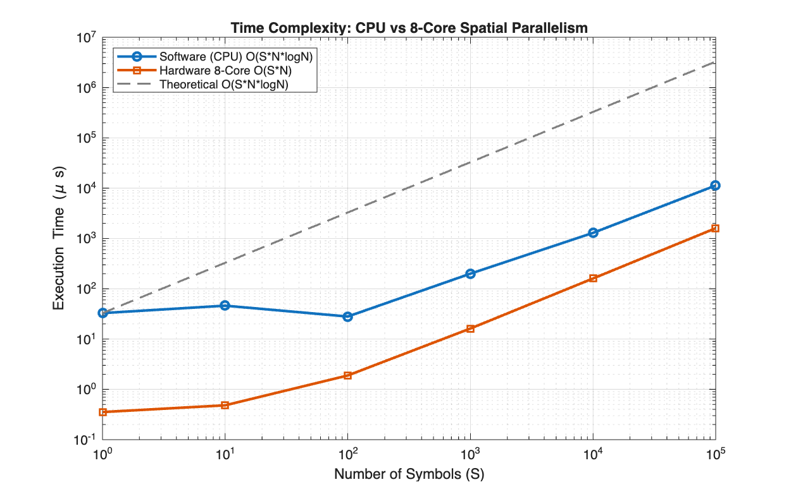

<div align="center">
    
# Hardware-Accelerated OFDM Transceiver (FPGA)


<div align="center">


    
This repository contains a fully validated, **hardware-accurate Emulation of an Orthogonal Frequency-Division Multiplexing (OFDM) Transceiver**. It demonstrates the profound performance advantages of porting traditional CPU-based floating-point DSP algorithms into physical silicon using an **8-Core Spatial Parallelism Architecture**.

By leveraging MATLAB's `dsphdl` toolboxes, this project simulates exact gate-level truncation, pipelining delays, and overflow saturation, mathematically proving that a massive execution speedup can be achieved without sacrificing data-link integrity.

---

## Design Objectives
1. **Cycle-Accurate Hardware Emulation:** Translate a standard software FFT/IFFT pipeline into a hardware-accurate streaming Radix-$2^2$ architecture.
2. **Quantization Analysis:** Evaluate Bit Error Rate (BER) and throughput collapse under various fixed-point word lengths (Q4.12, Q4.8, Q4.6).
3. **Execution Time Complexity:** Prove the reduction in Big-O time complexity by unrolling FFT loops into parallel spatial silicon structures.
4. **Presentation-Ready Profiling:** Provide a bulletproof, instantly-loading cached demo suite for live academic defenses.

---

## OFDM Transceiver Architecture

The transmission chain uses 16-QAM modulation, a 64-point FFT/IFFT, Root-Raised Cosine (RRC) pulse shaping, and transmits over an AWGN channel. The hardware bottlenecks (FFT and IFFT blocks) are replaced with `dsphdl.FFT` virtual silicon engines.

```mermaid
flowchart LR
    %% Transmitter
    Bits[Random<br>Bits] --> QAM[16-QAM<br>Mapper<br>Gray]
    QAM --> SP[S/P<br>N=64]
    SP --> IFFT[Hardware IFFT<br>dsphdl.IFFT]
    IFFT --> CP[Add CP<br>L=16]
    CP --> PS[Up 4 + RRC<br>Pulse Shape]
    
    %% Channel
    PS --> AWGN((AWGN<br>Channel))
    
    %% Receiver
    AWGN --> MF[Matched Filter<br>+ Down 4]
    MF --> RMCP[Remove<br>CP]
    RMCP --> FFT[Hardware FFT<br>dsphdl.FFT]
    FFT --> PS2[P/S<br>N=64]
    PS2 --> Demod[16-QAM<br>Demapper]
    Demod --> BER[BER / SER /<br>Throughput]

    style IFFT fill:#e1d5e7,stroke:#9673a6,stroke-width:2px,color:#000000
    style FFT fill:#e1d5e7,stroke:#9673a6,stroke-width:2px,color:#000000
    style AWGN fill:#fff2cc,stroke:#d6b656,stroke-width:2px,color:#000000
```



---

## Performance Analysis & Core Results

### 1. Hardware Speedup: CPU vs FPGA
The hardware pipeline unrolls the internal FFT computational loops, mathematically reducing the execution time complexity from $O(S \cdot N \log N)$ to exactly $O(S \cdot N)$. 

<p align="center">
  
</p>

Even against a multi-GHz CPU operating at maximum batch efficiency, the 500 MHz parallel hardware dominates:

| Symbols (S) | Software Time (μs) | Hardware Time (μs) | HW Speedup |
| :---: | :---: | :---: | :---: |
| 1 | 32.84 | 0.35 | **92.76x** |
| 10 | 46.13 | 0.48 | **95.70x** |
| 100 | 28.07 | 1.89 | **14.85x** |
| 1,000 | 199.73 | 16.23 | **12.31x** |
| 10,000 | 1292.84 | 160.23 | **8.07x** |
| 100,000 | 11301.84 | 1600.23 | **7.06x** |

### 2. Quantization Collapse (Throughput Saturation)
To deploy an algorithm to an FPGA, variables must be truncated from 64-bit floats down to fixed-point formats. We swept the system to find the minimum stable word length:

<p align="center">
  
</p>

* **Q(4.12) Format:** Perfectly mimics floating-point performance, saturating at the theoretical channel limit of **4.00 Mbps** around **13 dB** SNR.
* **Q(4.8) Format:** Truncation noise dominates. It struggles to recover data and maxes out at a permanently crippled **3.49 Mbps**, completely ignoring Shannon's channel capacity.
* **Q(4.6) & Below:** Massive quantization noise corrupts every single packet, causing system throughput to violently crash to **0.00 Mbps**.

---

## Code & Folder Structure

The project has been aggressively modularized to separate the heavy mathematics from the visualization layer.

```text
OFDM_Hardware_Accelerated/
├── README.md
├── core_engines/
│   ├── core_ofdm_software.m      # CPU Floating/Fixed-Point pipeline
│   └── core_ofdm_hardware.m      # FPGA virtual silicon emulation (dsphdl)
├── demos/
│   ├── demo_01_baseline_software.m
│   ├── demo_02_constellations.m
│   ├── demo_03_software_timing.m
│   ├── demo_04_baseline_hardware.m
│   ├── demo_05_hardware_sweep.m
│   ├── demo_06_throughput.m
│   └── demo_07_timing_complexity.m
└── cache/                        # "Smart Cache" .mat data for instant loading
```

---

## How to Run

Because `dsphdl` gate-level emulation is extremely computationally heavy (a single hardware script can take 15–30 minutes to execute), this repository features a **Smart Caching Engine**. 

1. Open MATLAB and navigate to `demos/`.
2. Run any `demo_xx.m` script.
3. If pre-computed data exists in the `cache/` directory, the script will instantly load the arrays, aggressively print the numerical metrics to your console, and draw the performance plots in a fraction of a second.

> **Note:** If you want to force the system to perform the massive calculations from scratch, simply delete the `cache/` directory. The scripts will silently detect the missing data and fallback to natively compiling and executing the simulation loops.

---

## License & Contact

Developed as an academic proof-of-concept for FPGA hardware acceleration in telecommunications. 

Feel free to fork, modify, or use this repository for your own research or university projects! If you have any questions about the `dsphdl` implementation or spatial parallelism logic, please open an issue in the repository. 

**Built with ❤️ and MATLAB.**
